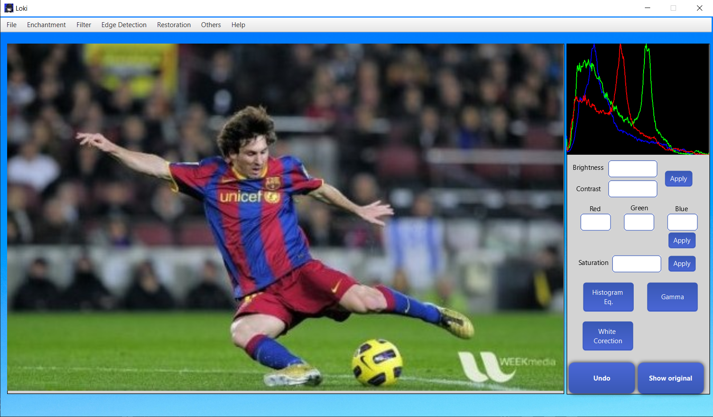

# l0k1

Image processing app, built for my bachelor degree thesis.

The idea was to implement a wide range of different image processing algorithms, and create a easy to use app with a intuitive interface, that doesn't require such a huge barrier of entry as traditional image editing apps.

## Features

The user enters the main screen, where he needs to upload an image of choice from his computer.



Once the image is selected, the user can access all available algorithms using the menu. It can stack multiple algorithms, while also having the possibility to undo the last action using the "Undo" button. You can also toggle the "Show original" to see the original image and compare the two to see the differences. After applying the algorithms, the user can save the processed image.

The algorithms implemented are the following:

- **Image Enchantement**: Brightness, Contrast, Histogram Equalisation, Color balance, Saturation, White balance, Gamma Correction

- **Filtering**: Gaussian blur, Sharpening, Median filter, Bilateral filter

- **Edge detection**: Sobel, Prewitt, Roberts Cross, Difference of Gaussians

- **Restoration**: Inpainting, Auto-inpainting, CLAHE, Adaptive tresholding

- **Other algorithms**: Watershed segmentation, HSV conversion, Morphological operations (dilation and erosion), Edge detection

The exact implementation of each algorithm can be found in the _Services_ package.

## Technologies used

For the implementation of the app the following were used:

- **JavaFX:** for building the user interface
- **OpenCV:** for image processing
- **SLFJ4:** for logging and testing (kinda)
- **Maven:** for dependency management

## How to run

As prerequisites you need Java 17+ and JavaFX SDK.

You can download the .jar file from the release tab and run it using the followin command:

```ps1
java --module-path \path\to\sdk\lib --add-modules=javafx.controls,javafx.fxml -jar \path\to\jar
```

Where for ```module-path``` you provide the path where the JavaFX SDK is located, and for ```-jar``` the location where you downloaded the jar.

Or you can also clone the repository and compile it yourself. Up to you!